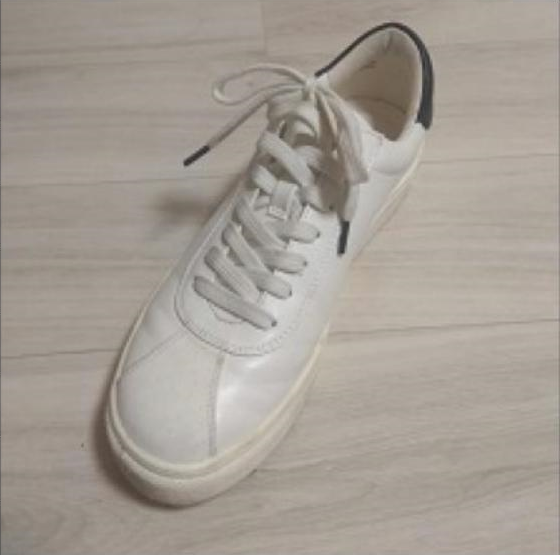
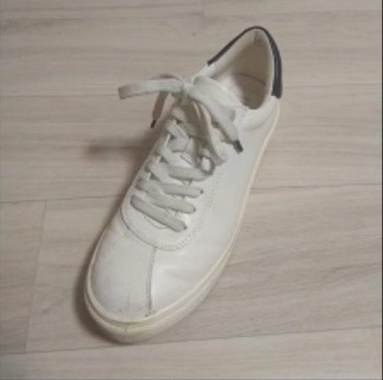
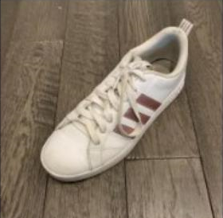
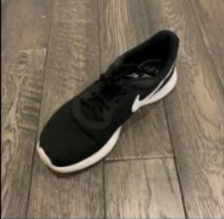

# 👟 Shoes Pair Classification

This repository contains a deep learning model for classifying pairs of shoes. The model is trained using convolutional neural networks (CNNs) to determine whether two shoes belong to the same pair.

---

## 📜 Table of Contents
- [🗂 Dataset](#-dataset)
- [🛠 Installation](#-installation)
- [📊 Data Preprocessing](#-data-preprocessing)
- [🧠 Model Training](#-model-training)
- [📈 Model Evaluation](#-model-evaluation)
- [🚀 Using the Model](#-using-the-model)
- [📸 Visualizations](#-visualizations)
- [📄 License](#-license)

---

## 🗂 Dataset
The dataset consists of images of shoes, labeled as matching or non-matching pairs. The images are preprocessed and augmented to enhance model performance.

- Data is stored in `data/` directory.
- Images are loaded and transformed using `torchvision.transforms`.
- Train-test split is performed before training.

---

## 🛠 Installation
To run this project, clone the repository and install the required dependencies:

```bash
# Clone the repository
git clone https://github.com/Moshe313/Shoes-Pair-Classification.git
cd Shoes-Pair-Classification
```

---

## 📊 Data Preprocessing
Before training, the data undergoes several preprocessing steps:
1. **Image Resizing** - All images are resized to a fixed dimension.
2. **Normalization** - Images are normalized for better training stability.
3. **Augmentation** - Data augmentation techniques (e.g., flipping, rotation) are applied.
4. **Tensor Conversion** - Images are converted to tensors for PyTorch compatibility.

Example of preprocessing:
```python
data  = np.zeros([10, 3, 2, 224, 224, 3])
data_dic  = {}
path  = "your/data/path"
for file in glob.glob(path):
    filename = file.split("/")[-1]  # get the name of the .jpg file
    img = np.asarray(Image.open(file))  # read the image as a numpy array

    # remove the alpha channel, normalize and subtract by 0.5:
    data_dic[filename] = (img[:, :, :3] / 255) - 0.5

Images = sorted([(key, value) for key, value in data_dic.items()])
Images = [value[1] for value in Images]
for num_of_t in range(data.shape[0]):
    for num_in_t in range(3):
        for direction in range(2):
            data[num_of_t, num_in_t, direction] = Images[num_of_t * 6 + num_in_t * 2 + direction]
```

---

## 🧠 Model Training
The model is based on a **Convolutional Neural Network (CNN)** architecture.

- The CNN extracts features from images.
- A **fully connected layer** classifies the images.
- **Loss function**: Cross-Entropy Loss
- **Optimizer**: Adam optimizer
- **Epochs**: 10+ (Adjustable)

---

## 📈 Model Evaluation
The trained model is evaluated using:
- Accuracy metrics
- Confusion matrices
- Precision-Recall curves

Example visualization:


---

## 🚀 Using the Model
Once trained, you can test the model using the provided example.

```python
# Create the positive and negative pairs
same = generate_same_pair(data)
same_to_predict = np.transpose(same, (0, 3, 1, 2))

correct_shown, incorrect_shown = False, False

sample = torch.Tensor(same_to_predict)
with torch.no_grad():
  sample_prediction = CNNChannel_model(sample)
sample_prediction = torch.argmax(sample_prediction, dim=1)
print(sample_prediction)

# display correctly classified:
correct_img, incorrect_img = np.ones((448,224,3)), np.ones((448,224,3))

for img in range(sample_prediction.shape[0]):
  if not correct_shown:
    if sample_prediction[img]:
      correct_img = same[img] + 0.5
  if not incorrect_shown:
    if not sample_prediction[img]:
      incorrect_img = same[img] + 0.5
  if correct_shown and incorrect_shown:
    break

percent = float(sum(sample_prediction)*100/sample_prediction.shape[0])
plt.figure(figsize=(7, 5))

plt.subplot(1, 2, 1)
plt.imshow(correct_img)
plt.title(f'Correctly classified {round(percent, 2)}%')

plt.subplot(1, 2, 2)
plt.imshow(incorrect_img)
plt.title(f'Incorrectly classified {round(100-percent, 2)}%')
plt.show()
```
To check accuracy :
```
print(f"CNNChannel accuracy: {get_accuracy(CNNChannel_model, data, batch_size=25)}")
print(f"CNN accuracy: {get_accuracy(CNN_model, data, batch_size=25)}")
```

---

## 📸 Visualizations
Here are some images from the training process:

### Example Image Pairs
| Image 1 | Image 2 | Label |
|---------|---------|--------|
|  |  | Matching |
|  |  | Not Matching |

---

## 📄 License
This project is licensed under the MIT License.

---

🚀 **Enjoy classifying shoe pairs!** 👟
